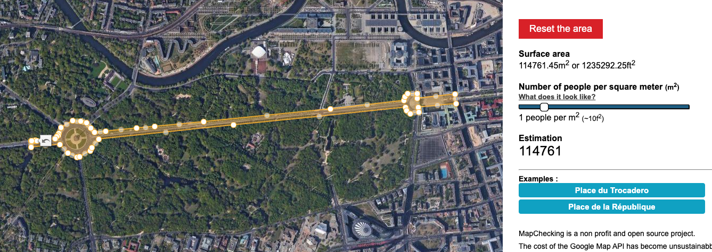
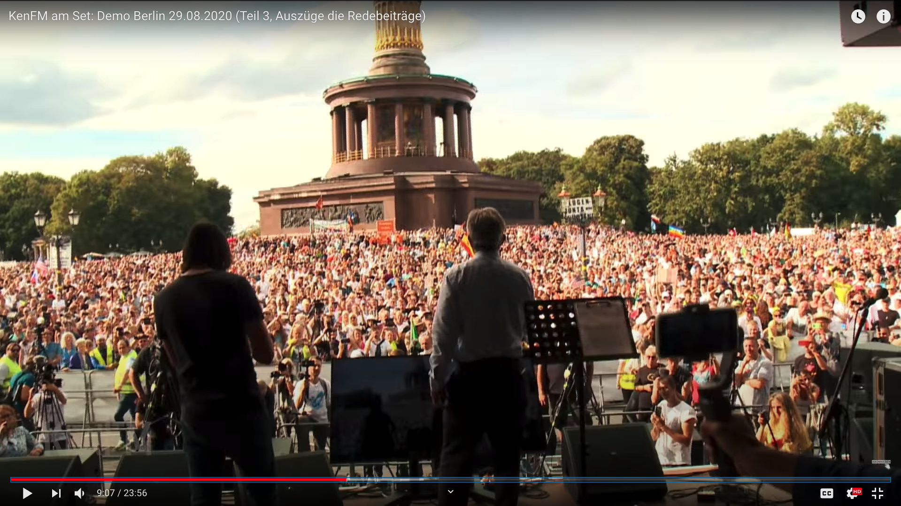
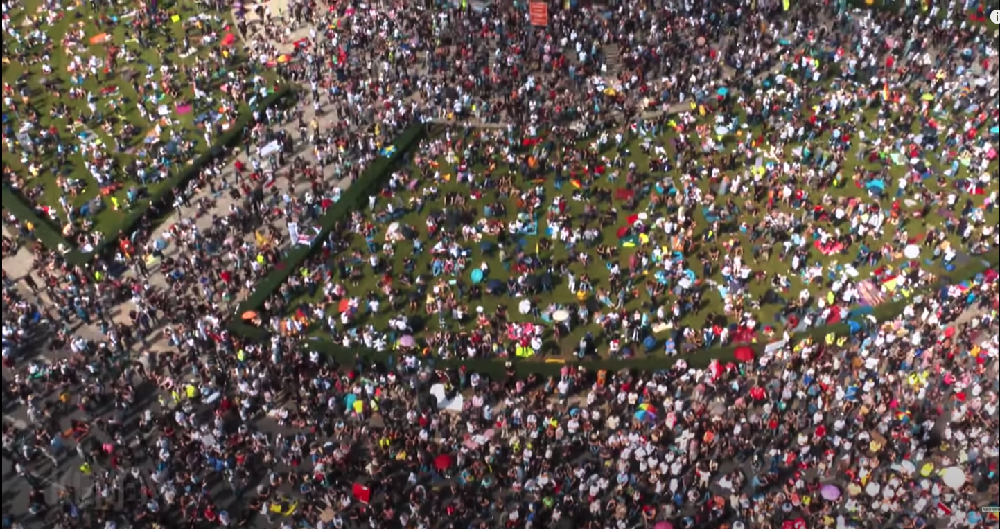
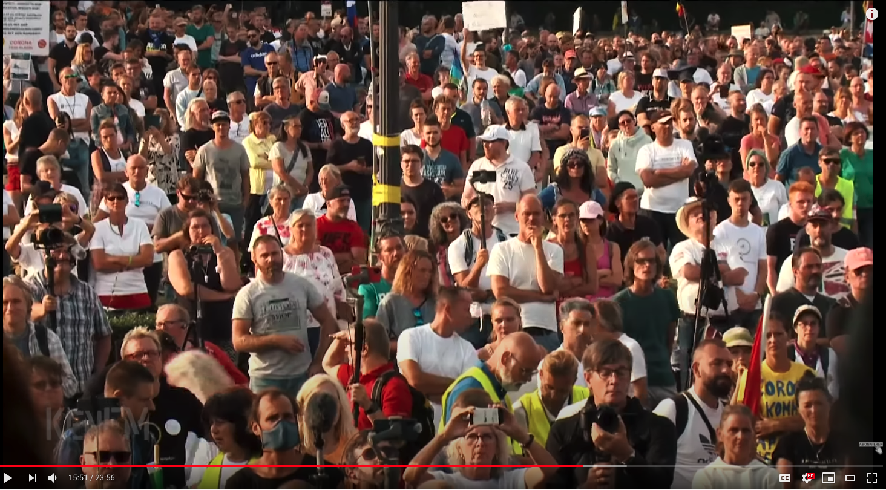
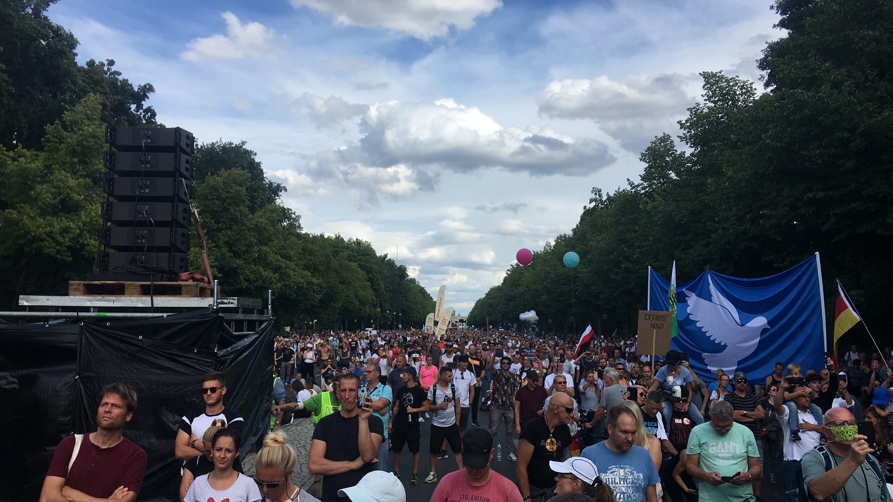
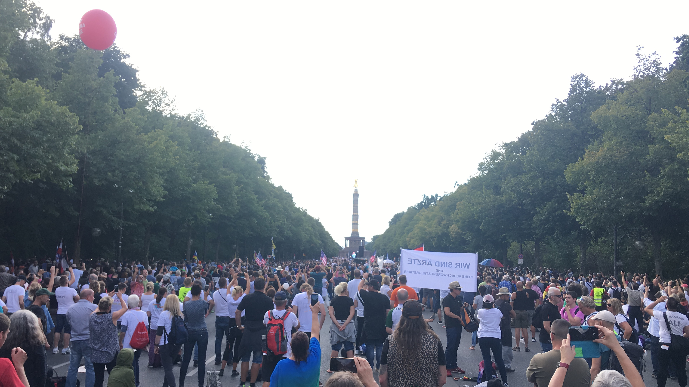
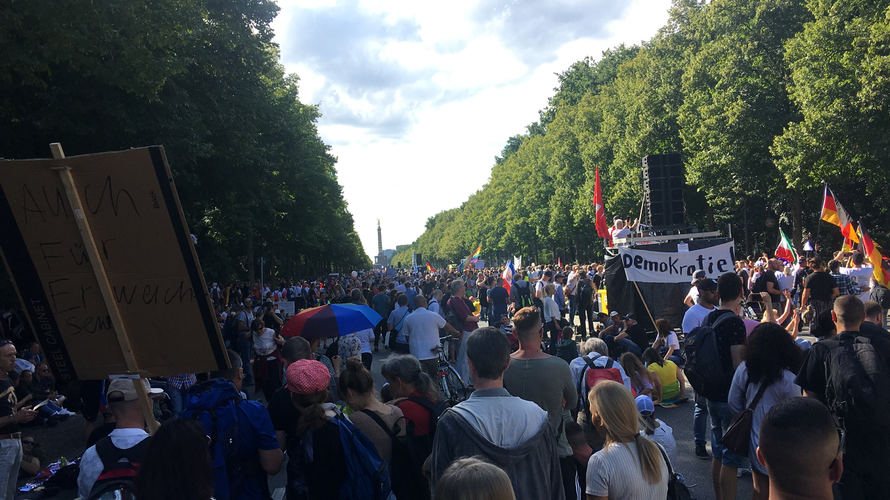
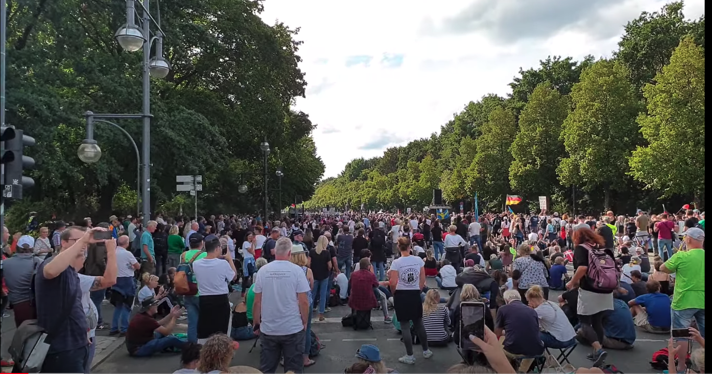
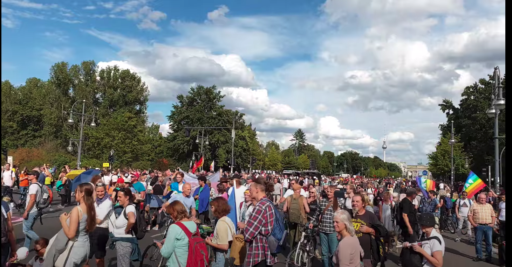

# Teilnehmeranzahl auf der Corona-Demo

Dies ist eine Schätzung der Anzahl der Teilnehmer auf der Demonstration gegen die Corona-Maßnahmen am 29.08.2020 in Berlin.


Die Polizei Berlin bezifferte die Gesamtzahl aller Demonstranten in Berlin mit 38.000 und der SPIEGEL kommt in seiner [Schätzung auf 32.500 Teilnehmer](https://www.spiegel.de/politik/deutschland/corona-proteste-in-berlin-faktencheck-zur-teilnehmerzahl-a-bed7b31e-53ab-48da-8643-16f368d4dec3). 


Diese Schätzungen erscheinen deutlich zu niedrig vergleicht man sie mit dem verfügbaren Karten- und [Bildmaterial](https://www.youtube.com/watch?v=XisCwTGsRGs).
Die “Bundesarbeitsgemeinschaft Kritischer Polizistinnen und Polizisten” [schreibt über die Anzahl der Demonstranten](https://www.kritische-polizisten.de/2020/08/verbot-des-demonstrationsverbots/): “Warum werden von den Berliner Behörden so klar wie leicht erkennbar falsche Zahlen in die Welt gesetzt?” und “Gestern waren nach unserer gesicherten Einschätzung hunderttausende auf den Straßen der Berliner Innenstadt mit unterschiedlichen Demonstrationszielen und in mindestens sieben verschiedenen Demonstrationen unterwegs.”

Die geschätzte Anzahl der Teilnehmer ist die Versammlungsfläche multipliziert mit der durchschnittlichen Menschendichte pro Quadratmeter:
```Versammlungsfläche * Menschendichte = Teilnehmeranzahl```. 

Die Folgende Schätzung ergibt **mindestens 100.000 bis 150.000 Teilnehmer**.

## Versammlungsfläche
Die Versammlungsfläche erstreckte sich vom Brandenburger Tor über die gesamte Straße des 17. Juni bis zur Siegessäule. Das entspricht [laut dieser Karte ungefähr 110000 Quadratmetern](https://www.mapchecking.com/#52.5144123,13.3468144;52.5141511,13.3468412;52.5142294,13.3487886;52.5138269,13.3494189;52.5136222,13.3501457;52.5136467,13.3503744;52.5139193,13.3512146;52.5140859,13.3513607;52.5145037,13.3518999;52.5151930,13.3627597;52.5160601,13.3766171;52.5158988,13.3767228;52.5157637,13.3770002;52.5158189,13.3777174;52.5160771,13.3776729;52.5162649,13.3810676;52.5167244,13.3809046;52.5165025,13.3775737;52.5167517,13.3775737;52.5167562,13.3768120;52.5165851,13.3766029;52.5164126,13.3764959;52.5159987,13.3705631;52.5153570,13.3603613;52.5151148,13.3564350;52.5150487,13.3549336;52.5148905,13.3524779;52.5148269,13.3515807;52.5150505,13.3512575;52.5153068,13.3509182;52.5153786,13.3504542;52.5154113,13.3498185;52.5146846,13.3499365;52.5147306,13.3487027;52.5147071,13.3486706;52.5146761,13.3486344;52.5146180,13.3485188;52.5145321,13.3483932;52.5144195,13.3468633;52.5144254,13.3468462;52.5144360,13.3468157;52.5144254,13.3469340;52.5144246,13.3469080;1;52.5132711,13.3536305,16
).



Diese Fläche umfasst noch nicht die Menschen, die sich ringsum im Tiergarten und in den angrenzenden Seitenstraßen verteilt hatten.

Die Versammlungsfläche war demnach *mindestens* 115.000 Quadratmeter.


## Menschendichte 
Die Rede von Robert F Kennedy Jr. um 16 Uhr war das Highlight der Demonstration. Demnach war die Menschendichte zu diesem Zeitpunkt am dichtesten. Luftbilder sind derzeit leider nur [zwischen 11](https://www.youtube.com/watch?v=0yoqgVTO3UE) und [14:30 Uhr](https://www.youtube.com/watch?v=USzIuE4u0Xk) zu finden.
Es sind jedoch zahlreiche Mitschnitte von Teilnehmern öffentlich verfügbar. Auf einer Auswahl solcher Videos basiert diese Schätzung. Vermutlich befanden sich durchschnittlich ungefähr eine Person pro Quadratmeter. [In der Nähe der Hauptbühne](https://www.youtube.com/watch?v=RloipY83ljg) war die Menschendichte erheblich höher.
Auch in der [Mitte der Straße des 17. Juni](https://www.youtube.com/watch?v=AB1NZJmDFng) bis zum Brandenburger Tor war die Menschendichte vermutlich sogar höher. Die Menschen stehen standen dicht auf der gesamten Breite der Straße und den Gehwegen.

Die Menschendichte war demnach *mindestens* eine Person pro Quadratmeter.

## Untere Grenze der Anzahl der Teilnehmer 
Eine Versammlungsfläche von 110.000 Quadratmetern mit einer Person pro Quadratmeter entspricht mindestens 110.000 Teilnehmern.
Das ist eine untere Grenze, denn die Versammlungsfläche war vermutlich eher größer und die Menschendichte eher höher.

## Fluktuation über den Tag
Diese Schätzung umfasst noch nicht die Fluktuation an Menschen über den Tag. Die Demonstration dauerte von morgens bis spät Abends, also mindestens 8 Stunden. Nicht alle Teilnehmer waren während der Kennedy-Rede anwesend. Die Teilnehmeranzahl über den Tag muss also nach oben korrigiert werden.

## Obere Grenze der Anzahl der Teilnehmer
Eine optimistischere Schätzung kann folgende Annahmen treffen:
- Die Versammlungsfläche war 10% größer, z.B. weil sich viele Teilnehmer im Tiergarten verteilt haben.
- Die Dichte war 10% höher, weil man auf vielen Videos mehr als ein Mensch pro Quadratmeter erkennt.
- Die Teilnehmeranzahl über den Tag war 10% höher, denn nicht alle Teilnehmer waren zum gleichen Zeitpunkt anwesend.

Das entspricht `110000 * 1,1 * 1,1 * 1,1 ~ 150000` Teilnehmer über den Tag verteilt.

## Ergebnis
Auf der Demonstration gegen die Corona-Maßnahmen am 29.8.2020 in Berlin waren schätzungsweise zwischen 100.000 und 150.000 Teilnehmer. 
Demnach protestierten drei bis vier mal mehr Menschen, als von der Polizei Berlin angegeben.


## Bildmaterial










